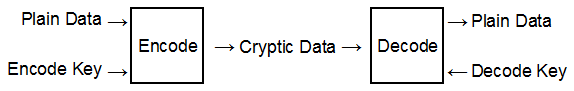

# Security Basics

There are many occasions that require moving and/or storing information in a
secure manner. Some of these include:

- Protecting personal information for customers or citizens.
- Protecting financial information during business transactions.
- Protecting secrecy during military operations.
- Protecting intellectual property from industrial espionage.
- Protecting the operation of banking systems or electrical power grids.
- Protecting... well you get it. There's a lot that needs protecting.

So, just what does "protecting" mean in this context? In each case above, there
is information. That information is plainly visible to the originator of the
information. It needs to be made plainly visible to the intended recipient of
that information. It needs to be kept out of the hands of those who are not
authorized to possess or use that information.

What does Wikipedia say about encryption?

_In cryptography, encryption is the process of encoding messages or information
in such a way that only authorized parties can read it. Encryption does not of
itself prevent interception, but denies the message content to the interceptor._
(https://en.wikipedia.org/wiki/Encryption)

Let's see a simple, but very common example scenario:

    You wish to make an online purchase with a credit card.
    You have your credit card information.
    The vendor needs that information to process your purchase.
    Criminals must not gain access to that information.

So, keeping an open mind, let's see how this might be done.

#### (A) Use a private communication channel.

The oldest way to keep unauthorized access to information is to only allow
access by authorized users. Secret couriers would carry messages of great
importance. Automated Teller Machines connect to the bank using special leased
line connections that only connect the machine to the bank and nothing else.
In modern times, it was not uncommon for a battle field to be criss crossed
with telegraph and telephone lines. Even homing pigeons have flown to their
roosts with messages attached to their tiny legs. All this in an attempt to
keep the messages safe from prying eyes.

So what can go wrong? Lots! The secret courier can be bribed or intercepted.
The message can be stolen or switched out with a false message. The wires can
be cut or tapped. Even the poor little pigeons can be blasted out of the sky or
hunted down by enemy (angry?) birds of prey.

In our example scenario, a private communication channel is not an option
because your connection to the vendor is over the public Internet and not a
private network. You could of course, place your information in a pouch and
send it to the vendor via a bonded courier service, but that would be slow and
expensive.

#### (B) Use an obscure communication channel.

Sometimes, designers attempt to secure communications by using an obscure or
undocumented communication method. In this approach, it is hoped that complex,
convoluted and above all undocumented communications will be enough to ensure
security. There's a special name for that kind of engineering. It's called
"bad".

I have no example to show this in action for our sample scenario, because no
one would be foolish enough to try it. Or would they... We could imagine a
scenario where you take a picture of your credit card, creating a file, called
say "card.png", then rename the file to "song.mp3" before emailing the file as
an attachment to the vendor. The vendor knows to detach the file and rename it
to "Jethro Clampett.png" so he can open the file and see the needed information.
There you go, we gots demm dere see cure itty!

As silly as this example is, it might even work. Unless someone intercepts the
email and takes more than 11 seconds examining the attachment.

On reflection, it seems that there is also an excellent example from history:

_**Epic Failure #1 - The long distance phone network.**_

In a long distance telephone network, phone calls are routed between telephone
company (telco) exchanges. The telco has to send this routing information in
a cost effective and secure manner. The solution arrived at was to use tones
as proxies for the commands and numeric data and send these down the phone line.
This was similar in concept to the standard "touch tone" dialing but with
non-standard tones. This allowed the same phone circuit to be used for both
telco signaling and customer calls.

To obscure things, the details of the exact pitches and command sequences were
not documented. It was a disaster in the making. First off, details of the
scheme were accidentally published followed by a clumsy attempt to suppress the
information. This involved company goons going to college libraries and
literally ripping out the offending pages from books. Secondly, anyone could
stumble across the tones, and several did. The most famous being that of a toy
whistle given away with a breakfast cereal that could generate the sound needed
to put the distant exchange into a mode where it would accept commands.

All of this lead to the rise of the "phone phreak" culture and the infamous
blue box phone hacking device. The security of the long distance phone system
was compromised and telco executives all lost out on a great deal of
champagne, caviar and lobster.

They did make changes though. Starting with heavy handed legal attacks, the
issue was not resolved until they switched to "out of band signaling". A fancy
way of saying that they began putting their sensitive data onto a private
communications channel not used for customer talk channels. This is where it
should have been all along.

A look at the interesting blue box is at: ( https://en.wikipedia.org/wiki/Blue_box )

#### (C) Protect the data with Encryption.

It should be clear by now that data that is encrypted is much more than data
that is merely obscured. So what is required for data to be encrypted?

1. Even given the details of the method of encryption, decoding the message
should be unfeasible for unauthorized parties. For example, the source code
of the encryption program can be publicly published without giving up the
coded messages' contents. Corollary: The algorithm or program source
code should be openly published.  Open source code is subject to criticism and
fault analysis by many talented programmers. Anytime that encryption code is
kept secret it means either that the code is weak, or that lawyers/morons
control the workplace, or both.

2. The process of creating the encoded message shall accept two inputs: the
message to be encoded and an encoding key.

3. The process of decoding the encoded message shall also accepts two inputs:
the encoded message and a decoding key.
Depending on the method of encryption employed, the encoding and decoding
keys may be the same (symmetrical key encryption) or different (asymmetrical
key encryption).

4. The key used to decode the messages shall be kept secret. The encoding key
may be public unless it is the same as the decoding key. In that case, it too
must be kept secret.

Let's take our first, simplified view of how encryption moves data:

In this diagram, the encode and decode steps take place in the secure locations
of your computer and the vendor's computer respectively. The cryptic data is
transmitted openly on the public network.

We can finally make our purchase. We can send our credit card information to
the vendor because only he has the decoding key needed to read the message.
Just how he gets that key is matter for later study. Should any criminal
element intercept our (cryptic) purchase data, it is of no use to them because
they do not have the decoding key.

At last, Internet commerce may proceed. Stock options for everyone!

## Conclusion

This concludes the first part. Let's summarize:

- Security is not a matter of having things to hide from the light of day.
Security is needed to keep society functioning. The simple example above is but
one of a billion uses of encryption to provide security employed each day.
- There is no security in obscurity.
- Open software is always to be preferred to proprietary software.
- Engineering choices should be made on the basis of engineering principles,
not expediency or politics.
- Messing up security can be embarrassing and expensive.

If it sounds like "encryption is hard", it is. That is why this is only a
introduction to the topic. Hopefully you will enjoy the peek into how the
world of secrets works.

Finally, this section has been flying a hundred thousand feet over our subject.
In the next sections we start descending and seeing more of the details.

## Homework/Quiz

There is no homework assigned. There will be no quiz on Monday.
